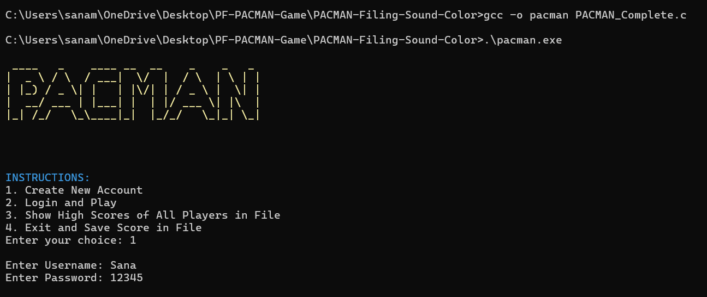
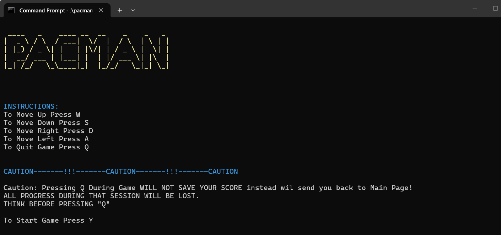
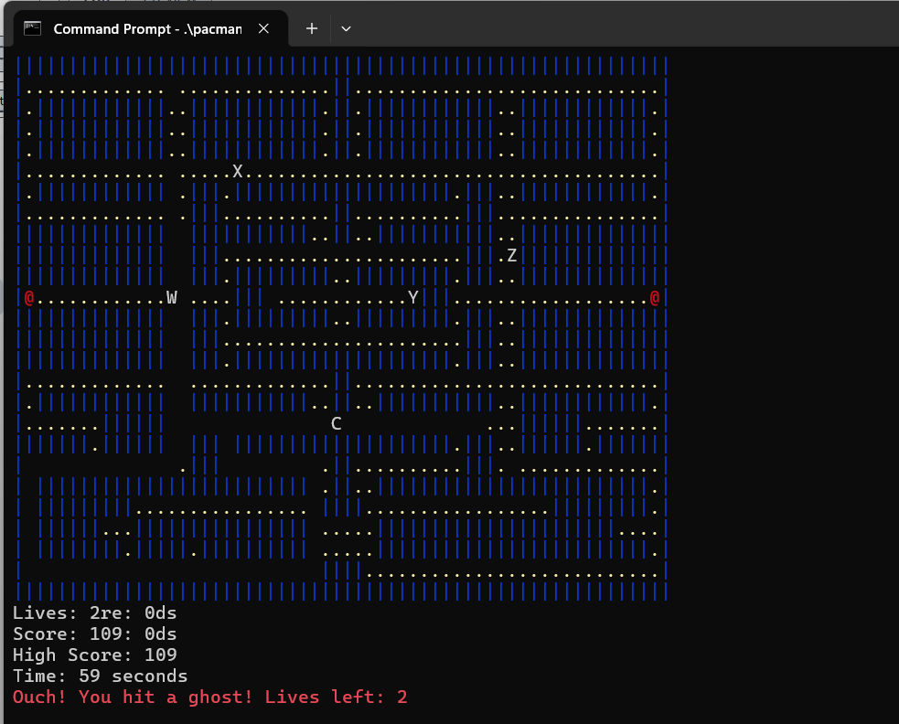
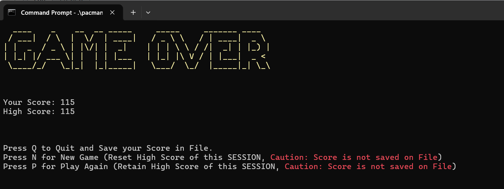
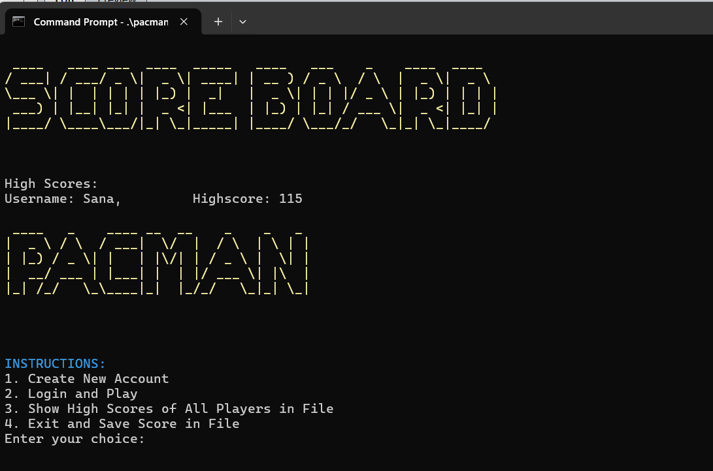

# PAC-MAN — Console Game in C

## Overview

A terminal-based implementation of the classic PAC-MAN arcade game, built entirely in C as a **Programming Fundamentals (PF) course project**. The game runs in the console and reproduces core PAC-MAN mechanics including ghost movement, coin and power-coin collection, lives, scoring, and a persistent file-based leaderboard. An enhanced version adds color output, audio feedback, and player account management. A separate macOS-compatible build is also included with platform-specific terminal handling.

## Features

**Core Gameplay:**
- Console-rendered maze with walls (`|`), coins (`.`), and power coins (`@`)
- PAC-MAN movement via WASD keys (upper and lowercase)
- 4 ghosts: 2 move horizontally, 2 move vertically — all with independent movement logic
- Power coin activates a 5-second window in which PAC-MAN can eat ghosts
- PAC-MAN starts with 3 lives; losing all lives or collecting all coins ends the game

**Progress & Score Tracking:**
- Real-time elapsed time display
- Current score and highest score tracked across sessions
- Scores saved to file only if they exceed the player's previous high score

**Account Management (Enhanced Version):**
- Players create an account (username and password) stored in a file
- Login required to play; scores are tied to the logged-in account
- Leaderboard view shows all registered players' high scores

**End-of-Game Options:**
- New Game: resets all state including score
- Play Again: retains high score, resets other state

**Visual and Audio (Enhanced Version):**
- Colored terminal output using ANSI/Windows console APIs
- Audio feedback on specific in-game events

## Tech Stack

**Language:** C

**Libraries:**
- `<stdio.h>` — standard I/O
- `<conio.h>` — real-time keyboard input (`kbhit`, `getch`)
- `<windows.h>` — console control and cursor manipulation (Windows build)
- `<termios.h>`, `<fcntl.h>` — non-blocking input (macOS build)
- `<stdbool.h>` — boolean types
- `<time.h>` — elapsed game time tracking
- `<string.h>` — string operations

**File Management:** Plain text files for player credentials, scores, and leaderboard persistence

## System Design / Working

**Map Representation:**

The game map is stored as a 2D `char` array of fixed dimensions (`Height × Width`). Walls, coins, and power coins are embedded directly in the array. The render function iterates the array and prints each cell with appropriate formatting.

**Game Loop:**

The main loop uses `time()` for frame timing. Each iteration checks for keyboard input via `kbhit()` — if a key is pressed, it updates PAC-MAN's direction (`dx`, `dy`). The map is then updated: PAC-MAN's new position is calculated, collision with walls is checked via an `IsWall()` function, and coins are consumed on contact. Ghost positions are updated after each PAC-MAN move.

**Ghost Behavior:**

Each of the four ghosts has a fixed axis of movement. Two ghosts patrol horizontally (bouncing direction on wall contact), and two patrol vertically. Ghost-PAC-MAN collision detection checks if their grid positions overlap. If PAC-MAN has an active power-up, ghost collision has no effect (ghosts are "eaten"); otherwise, a life is deducted and PAC-MAN is repositioned to the starting coordinate.

**Power Coin Mechanic:**

A global flag `powerUpActive` and a `powerUpStart` timestamp control the power-up state. When active, the elapsed time is checked each frame; after 5 seconds, the flag is reset.

**Coin Collection:**

The `AllCoinsCollected()` function scans the map array for any remaining coin characters. If none are found, the win condition is triggered.

**File-Based Persistence:**

Player credentials are written to a text file on account creation and read on login. High scores are updated in a scores file only when the current session's score exceeds the stored value. The leaderboard is read from the scores file and printed.

**macOS Build:**

The macOS version (`PACMAN_for_MACOS/`) replaces `<conio.h>` with POSIX `termios`-based non-blocking input using `enable_non_blocking_input()` and `hide_cursor()` helper functions. The render function uses `printf` with ANSI escape codes for cursor repositioning.

## Screenshots
- "PAC-MAN main menu screen"

- "PAC-MAN start screen with ASCII title art and game instructions"

- "Gameplay view — maze with coins, ghosts, and live score display"

- "Game Over screen with option to save current session, or play new game"

- "Leaderboard showing all registered player high scores"


## How to Run Locally

### Windows (Full/Enhanced Version)

```bash
# Compile with any C compiler (GCC/MSVC)
gcc -o pacman PACMAN_Complete.c

# Run
pacman.exe
```

### macOS Build

```bash
cd PACMAN_for_MACOS

# Compile all source files
gcc -o  pacman PACMAN_Complete.c

./pacman
```

## Folder Structure

```
PF-PACMAN-Game/
├── PACMAN_for_WINDOWS/
│   ├── PACMAN_Complete.c       # Full enhanced version (Windows) — color, sound, file I/O
│   └── PACMAN Report.pdf       # Project report
└── PACMAN_for_MACOS/
    ├── (A) PACMAN-MacVersion.c # Unified macOS-compatible build
    ├── 0) Terminal-Technicalities-Function.c
    ├── 1) Time-Function.c
    ├── 2) Is-Wall-Function.c
    ├── 3) Initialise-Game.c
    ├── 4) Render-Function.c
    ├── 5) All-Coins-Collected-Function.c
    └── 6) Main-Function.c      # Main game loop entry point
```
---
Enjoy the game!! Good Luck!
